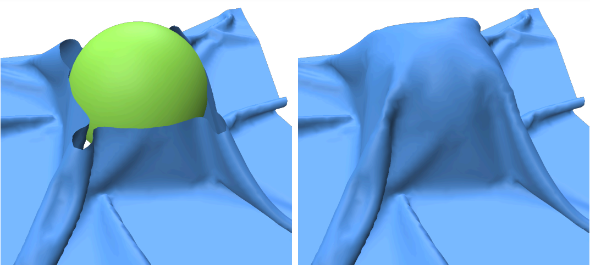

# Inpainting Holes in Folded Fabric Meshes

This repository contains a research prototype implementation of the paper [Inpainting Holes in Folded
Fabric Meshes](https://www.sciencedirect.com/science/article/abs/pii/S0097849323000808), Computers & Graphics. 

The method proposes to fill holes in triangle mesh surfaces representing fabrics. The software allows
the user to provide a mesh with a hole and to fill it.

## Build Instructions

The project requires CGAL to be installed on your computer. Instructions for installing CGAL can be found [here](https://doc.cgal.org/latest/Manual/installation.html). It also requires on geometry-central, 
polyscope and libIGL as well as a C++17 compiler.
You can build the project as follows:
```
git clone --recurse-submodules https://github.com/g-gisbert/Inpainting-Holes-In-Folded-Fabric-Meshes
cd Inpainting-Holes-In-Folded-Fabric-Meshes
mkdir build
cd build
cmake ..
make -j8
```

## Run Instructions

You can run the app by issuing:
```
./bin/pgm <path/to/file>
```
If you want to run the teaser example, you can just type:
```
./bin/pgm ../data/sim1_hole.obj
```

## Adding colliding objects

You can edit the config.txt file to add colliding objects to constraint the optimization.
You can use spheres or cylinders. Each row corresponds to one object. For spheres, you can add them as follows:
```
# sphere x y z radius
sphere 0 0.5 0 1.3
```
For cylinders, you must also specify the height and the three Euler angles that control the rotation.
```
# cylinder x y z radius height eulerX eulerY eulerZ
cylinder -3.65421 0.652517 0.0 1 6 0 -1.415462 0
```

By default, the sphere corresponding to the teaser is active. You can disable it by commenting the line
with a '#' character at the beginning of the corresponding line.

## Using the GUI

Hold down the left mouse button and move the mouse to rotate.
Right-click to move the camera.

In the right panel, you can set up the coefficients for each energy term in the 
minimization as well as the fixed time step. Then you can choose between two bending energies and enable or disable collisions.
Finally, there are three buttons. 'Steps' will perform 2000 gradient descent steps, 'Toggle' will continuously optimize the mesh
and 'Save Mesh' allows you to export the optimized mesh.

To reproduce the teaser example, just press the 'Steps' button.

## Typical parameters

Typical parameters you can use for the given examples.

| Filename | Edge Lengths | Bending | Repulsive |
| --- |--------------|--------| --- |
| sim1_hole | 0.1 | 0.02   | 0.01 |
| curtain | 0.1 | 0.003  | 0.01 |
| contour | 0.1 | 0.003  | 0.01 |
| paper1 | 0.1 | 0.003  | 0.01 |
| paper2 | 0.4 | 0.02   | 0.01 |
